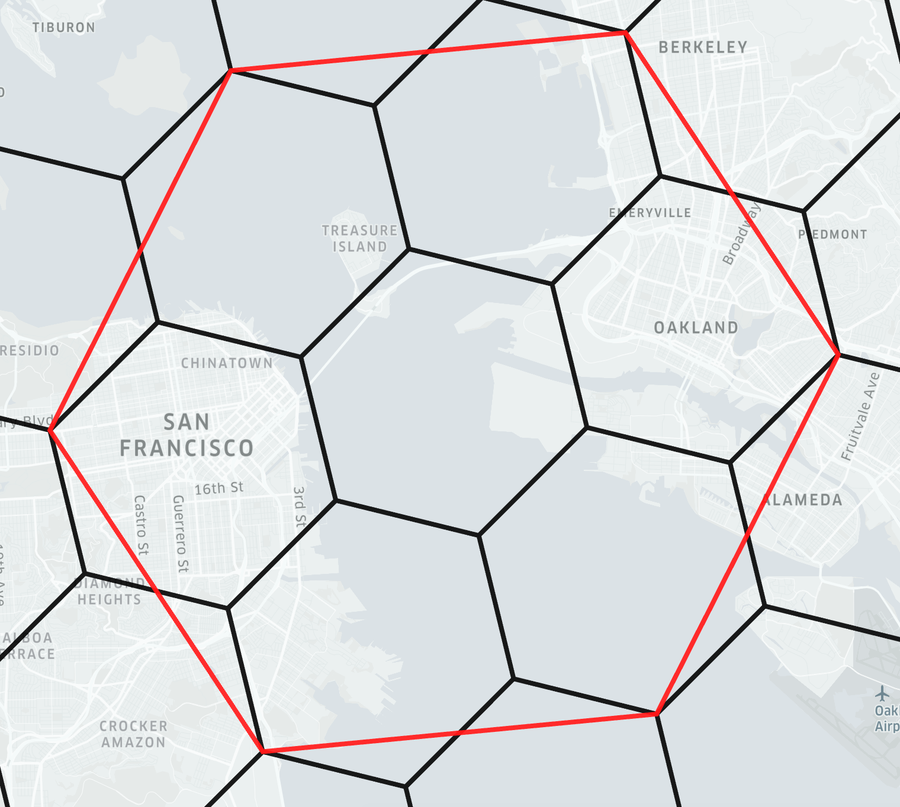
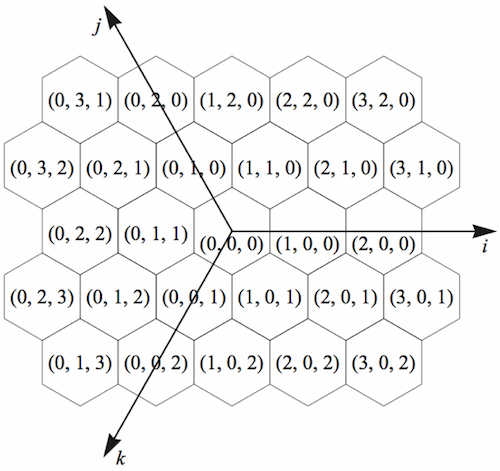

# 2D Geo Zones

# H3Geo

## What is H3

H3 is a geospatial indexing system that partitions the world into hexagonal cells. [More info](https://h3geo.org/docs/).

Every hexagonal cells has seven children below in its hierarchy. [More info](https://h3geo.org/docs/highlights/indexing).

The H3 grid is constructed on the icosahedron by recursively creating increasingly higher precision hexagon grids until the desired resolution is achieved. Each resolution of the grid contains 12 pentagons. The finest resolution is 15, and has an area of less than 1 meter squared. [More info](https://h3geo.org/docs/core-library/overview/).

[Table of cell statistics and resolutions](https://h3geo.org/docs/core-library/restable/).

## IJK Coordinates

Hexagon planar grid systems have three coordinate axes set 120 degrees apart. 

Each grid resolution is rotated approximately 19.1 degrees relative to the next coarser resolution. The rotation alternates between counterclockwise and clockwise at each successive resolution, creating what's known as Class II or Class III grids. The resolution 0 cells are Class II. [More info](https://h3geo.org/docs/core-library/coordsystems).

## Conversion between H3 index and Latitude-Longitude

### H3 Index

An H3 Index is a 64-bit integer that represents a hexagonal cell on Earth's surface at a specific resolution.

H3Geo provides functions to convert between latitude, longitude, and resolution to H3 Index and vice versa with `latLngToCell` and `cellToLatLng` functions. [More info](https://h3geo.org/docs/api/indexing)

# Mapbox

## Layer

A Mapbox layer defines how specific map features such as Point of interests are visually represented in Mapbox style. Layers can display different types of data, such as points, lines, polygons, or symbols.

### Dataset

A Dataset in Mapbox is an editable collection of GeoJSON features and their properties. Datasets are used for data that needs to be updated or edited frequently. However, datasets cannot be used directly in a map style as a layer. Instead you must first export a dataset to a tileset. [More info](https://docs.mapbox.com/studio-manual/reference/datasets/)

### Tileset

A tileset is a collection of  raster or vector data broken up into a grid of tiles, optimied for rendering and not directly editable. [More info](https://docs.mapbox.com/studio-manual/reference/tilesets/)

## How to upload GeoJson Data to Mapbox

To host the data in Mapbox, you can periodically upload the GeoJSON to Mapbox using [Uploads API](https://docs.mapbox.com/help/glossary/uploads-api/) or [Mapbox Tiling Service](https://docs.mapbox.com/mapbox-tiling-service/vector/#create-a-new-tileset-that-uses-incremental-updates). However this better for data that updates less frequently(hourly or daily).