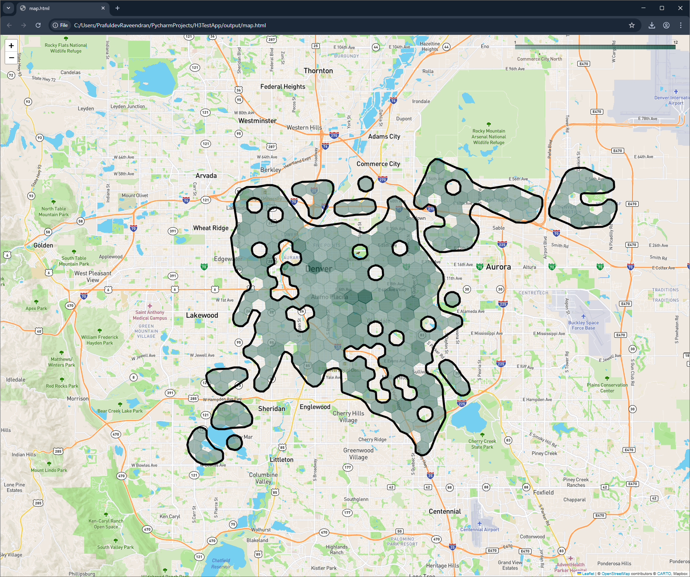
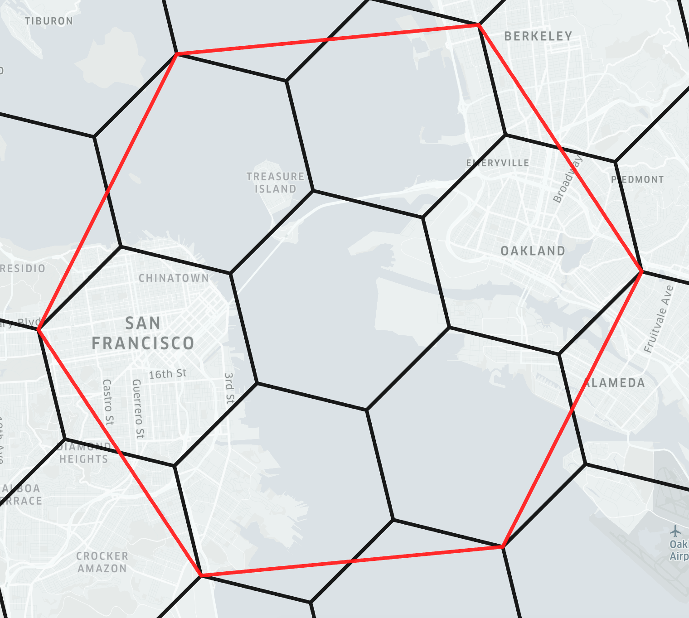
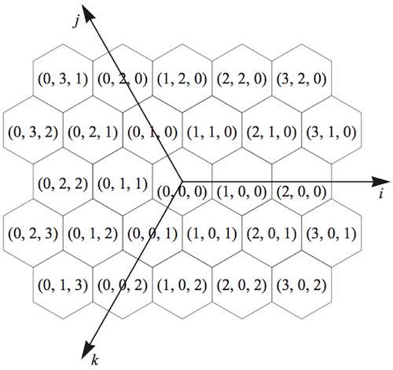

# Scripts

## Upload GeoJSON to Mapbox

[upload_geojson_to_mapbox.py](src/upload_geojson_to_mapbox.py)

This script uploads a local GeoJSON file to Mapbox and creates a custom tileset.

### What It Does

1. Creates a valid tileset ID from a name.
2. Requests temporary S3 credentials from Mapbox.
3. Uploads the GeoJSON file to the S3 bucket using those credentials.
4. Tells Mapbox to start processing the upload as a tileset.

## Render H3 Tiles, draw outlines, smoothen, and export as Geojson files

[draw_h3cells_and_outline.py](src/draw_h3cells_and_outline.py)

This script processes spatial point data, groups it using H3 hexagons, and creates an interactive map with colored hexagons and polygon outlines around connected regions.

### What It Does

1. Loads a CSV file with geographic points.
2. Filters and maps each point to an H3 cell at a fixed resolution.
3. Aggregates counts per hex cell.
4. Groups neighboring hexagons into clusters using geometry relationships.
5. Computes outlines around each group (merged polygons).
6. Draws the hexagons and outlines on a Folium map.
7. Saves individual group outlines to separate GeoJSON files.
8. Opens the result in the browser.

### Output

[Goto Output folder](output)

# General Info on the Topic

# H3Geo

## What is H3

H3 is a geospatial indexing system that partitions the world into hexagonal cells. [More info](https://h3geo.org/docs/).

Every hexagonal cells has seven children below in its hierarchy. [More info](https://h3geo.org/docs/highlights/indexing).

The H3 grid is constructed on the icosahedron by recursively creating increasingly higher precision hexagon grids until the desired resolution is achieved. Each resolution of the grid contains 12 pentagons. The finest resolution is 15, and has an area of less than 1 meter squared. [More info](https://h3geo.org/docs/core-library/overview/).

[Table of cell statistics and resolutions](https://h3geo.org/docs/core-library/restable/).

## IJK Coordinates

Hexagon planar grid systems have three coordinate axes set 120 degrees apart. 

Each grid resolution is rotated approximately 19.1 degrees relative to the next coarser resolution. The rotation alternates between counterclockwise and clockwise at each successive resolution, creating what's known as Class II or Class III grids. The resolution 0 cells are Class II. [More info](https://h3geo.org/docs/core-library/coordsystems).

## Conversion between H3 index and Latitude-Longitude

### H3 Index

An H3 Index is a 64-bit integer that represents a hexagonal cell on Earth's surface at a specific resolution.

H3Geo provides functions to convert between latitude, longitude, and resolution to H3 Index and vice versa with `latLngToCell` and `cellToLatLng` functions. [More info](https://h3geo.org/docs/api/indexing)

# Mapbox

## Layer

A Mapbox layer defines how specific map features such as Point of interests are visually represented in Mapbox style. Layers can display different types of data, such as points, lines, polygons, or symbols.

### Dataset

A Dataset in Mapbox is an editable collection of GeoJSON features and their properties. Datasets are used for data that needs to be updated or edited frequently. However, datasets cannot be used directly in a map style as a layer. Instead you must first export a dataset to a tileset. [More info](https://docs.mapbox.com/studio-manual/reference/datasets/)

### Tileset

A tileset is a collection of  raster or vector data broken up into a grid of tiles, optimized for rendering and not directly editable. [More info](https://docs.mapbox.com/studio-manual/reference/tilesets/)

## How to upload GeoJson Data to Mapbox

To host the data in Mapbox, you can periodically upload the GeoJSON to Mapbox using [Uploads API](https://docs.mapbox.com/help/glossary/uploads-api/) or [Mapbox Tiling Service](https://docs.mapbox.com/mapbox-tiling-service/vector/#create-a-new-tileset-that-uses-incremental-updates). However this better for data that updates less frequently(hourly or daily).

### Supported File Formats for Uploads API

The following file types are supported:

* **GeoJSON**
* **KML**
* **GPX**
* **Shapefile** (must be uploaded as a `.zip` file)
* **CSV**
* **GeoTIFF**
* **MBTiles**

More details: [Accepted file types and transfer limits](https://docs.mapbox.com/studio-manual/guides/geospatial-data/#accepting-file-types-and-transfer-limits)

---

### File Types That Support Holes in Polygons

| Format         | Supports Holes                   | Reference Links                                                                                                  |
| -------------- | -------------------------------- | ---------------------------------------------------------------------------------------------------------------- |
| **GeoJSON**    | ✅ Yes (using inner rings)        | [GeoJSON Spec (RFC 7946)](https://datatracker.ietf.org/doc/html/rfc7946#section-3.1.6)                           |
| **Shapefiles** | ✅ Yes (with rings/multipolygons) | [ESRI Shapefile Spec](https://www.esri.com/library/whitepapers/pdfs/shapefile.pdf)                               |
| **MBTiles**    | ✅ Yes (supports vector tiles)    | [Vector Tiles Winding Order](https://docs.mapbox.com/data/tilesets/guides/vector-tiles-standards/#winding-order) |

Example: [Polygon with a Hole in GeoJSON](https://gist.github.com/andrewharvey/978590af4d5ebb1d0ed122da6ce7ebea#file-polygon-with-a-hole-geojson)

### Outlining a Group of H3 Cells

* Concave hull methods like **k-Nearest Neighbors** or **Ball-Pivoting** can outline H3 cells, but they have problems with shapes that have deep cuts or openings (like a **U** shape). When the cells are turned into points, some shape details are lost. As a result, the concave hull often closes gaps and creates an outline that doesn’t match the original shape.
* In python, `unary_union` function does a better job of finding the polygon outline.

### Smoothing Sharp Corners

[Chaikin’s Algorithm](https://observablehq.com/@pamacha/chaikins-algorithm) smooths polygon edges by iteratively cutting corners.